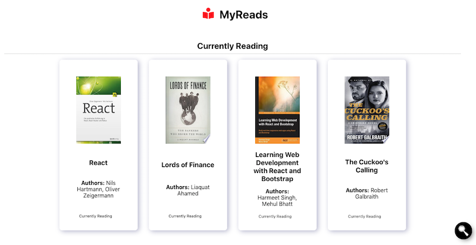

<!--   -->

<p align="center"><a href="https://cogoport.github.io/cogo-toast/" target="_blank"></a></p>
<h1 align="center">My Reads</h1>

<!-- 
# MyReads: A Book Tracking App   -->
## Udacity React Developer Nanodegree Project 1 - Introduction

This MyReads App is the first project of the Udacity React Developer Nanodegree and follows the "MyReads project rubric" and all the style guides provided by Udacity:
- CSS Style Guide
- HTML Style Guide
- JavaScript Style Guide
- Git Style Guide

## Overview



## Udacity Specification

- In MyReads project, I had to create a bookshelf app that allows me to select and categorize books I have read, am currently reading, or want to read. The project emphasizes using React to build the application and provides an API server and client library that you will use to persist information as you interact with the application.
 
## Udacity Requirements

### Application Setup
- [x] The application was created with create-react-app and requires only npm install and npm start to get it installed and launched.
- [x] An updated README that describes the project and has instructions for installing and launching the project is included.

### Main Page
- [x] The main page shows 3 shelves for books. Each book is shown on the correct shelf, along with its title and all of its authors. 
- [x] The main page shows a control that allows users to move books between shelves. The control should be tied to each book instance. The functionality of moving a book to a different shelf works correctly.
- [x] When the browser is refreshed, the same information is displayed on the page.

### Search Page
- [x] The search page has a search input field.
- [x] The search page behaves correctly.
- [x] Search results on the search page allow the user to select “currently reading”, “want to read”, or “read” to place the book in a certain shelf.
- [x] When an item is categorized on the search page and the user navigates to the main page, it appears on that shelf in the main page.

### Routing
- [x] The main page contains a link to the search page. When the link is clicked, the search page is displayed and the URL in the browser’s address bar is /search.
- [x] The search page contains a link to the main page. When the link is clicked, the main page is displayed and the URL in the browser’s address bar is /.

### Code Functionality
- [x] Component state is passed down from parent components to child components. 
- [x] The state variable is not modified directly - setState() function is used correctly.
- [x] Books have the same state on both the search page and the main application page: If a book is on a bookshelf, that is reflected in both locations.
- [x] The code runs without errors. There are no warnings that resulted from not following the best practices listed in the documentation, such as using key for list items. All code is functional and formatted properly.

## How to install and use it?

- Download the files, cd into root directory and run:
```bash
# Install dependencies
$ npm install

# Run the app
$ npm start
```  

## References and Resources

- This project was bootstrapped with [Create React App](https://github.com/facebook/create-react-app).
- [CSSmatic](https://cssmatic.com/box-shadow)
- [React Icons](https://react-icons.netlify.com/#/icons/fa)
- [Dummy Image](https://dummyimage.com/)
- [React Documentation](https://reactjs.org)
- [MDN Documentation](https://developer.mozilla.org)
